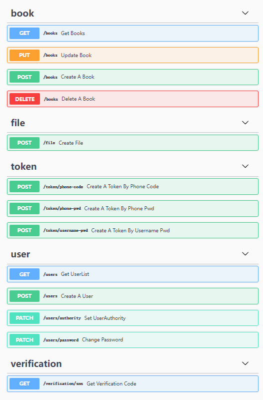

# go-gin-restful-api

## 一个gin的项目Demo,主要用于RESTFul Api和 gin的实践.项目结构和代码用于新项目的参考项目采用了 gorm作为 orm, viper作为配置读取, swagger作为api文档生成测试工具,集成了JWT, 阿里云OSS,腾讯云短信等

````
 ██████╗  ██████╗        ██████╗ ██╗███╗   ██╗      ██████╗ ███████╗███████╗████████╗███████╗██╗   ██╗██╗       █████╗ ██████╗ ██╗
██╔════╝ ██╔═══██╗      ██╔════╝ ██║████╗  ██║      ██╔══██╗██╔════╝██╔════╝╚══██╔══╝██╔════╝██║   ██║██║      ██╔══██╗██╔══██╗██║
██║  ███╗██║   ██║█████╗██║  ███╗██║██╔██╗ ██║█████╗██████╔╝█████╗  ███████╗   ██║   █████╗  ██║   ██║██║█████╗███████║██████╔╝██║
██║   ██║██║   ██║╚════╝██║   ██║██║██║╚██╗██║╚════╝██╔══██╗██╔══╝  ╚════██║   ██║   ██╔══╝  ██║   ██║██║╚════╝██╔══██║██╔═══╝ ██║
╚██████╔╝╚██████╔╝      ╚██████╔╝██║██║ ╚████║      ██║  ██║███████╗███████║   ██║   ██║     ╚██████╔╝███████╗ ██║  ██║██║     ██║
 ╚═════╝  ╚═════╝        ╚═════╝ ╚═╝╚═╝  ╚═══╝      ╚═╝  ╚═╝╚══════╝╚══════╝   ╚═╝   ╚═╝      ╚═════╝ ╚══════╝ ╚═╝  ╚═╝╚═╝     ╚═╝
 ````

### 使用步骤

1. 复制 config-example.yaml 并重命名为 config.yaml,填上自己的配置
2. go run main.go
3. 访问 http://localhost:8000/swagger/index.html 即可看到接口文档

### 接口列表



### 配置文件

````yaml
app:
  pageSize: 10

server:
  mode: debug
  addr: 8000
  readTimeout: 60
  writeTimeout: 60

  aliOSS:
    endpoint: oss-cn-hangzhou.aliyuncs.com
    accessKeyId: [ 阿里云accessKeyId ]
    accessKeySecret: [ 阿里云accessKeySecret ]
    bucketName: [ bucket ]
    bucketUrl: [ bucket url ]

database:
  type: mysql
  user: xxx
  password: xxxx
  host: xx.xx.xxx.xx:3306
  name: [ 数据库名 ]

tencent:
  secretId: [ 腾讯云secretId ]
  secretKey: [ 腾讯云secretId ]

redisDB:
  addr: xx.xxx.xx.xx:6379
  password: xxxxx
  db: 0

jwt:
  signingKey: [ jwt signingKey ]
  expiresTime: [ 604800, token过期时长 ]
  bufferTime: [ bufferTime ]

zap:
  level: 'info'
  format: 'console'
  prefix: '[AKA_ZWZ]'
  director: 'log'
  linkName: 'latest_log'
  showLine: true
  encodeLevel: 'LowercaseColorLevelEncoder'
  stacktraceKey: 'stacktrace'
  logInConsole: true
````

### 鸣谢

[](https://www.jetbrains.com/?from=go-gin-restful-api)
